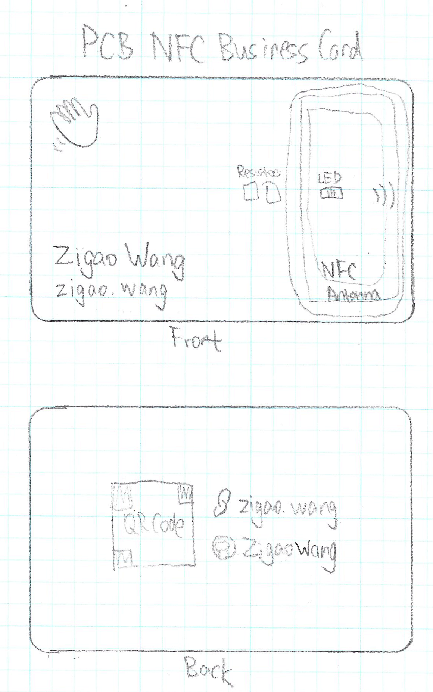
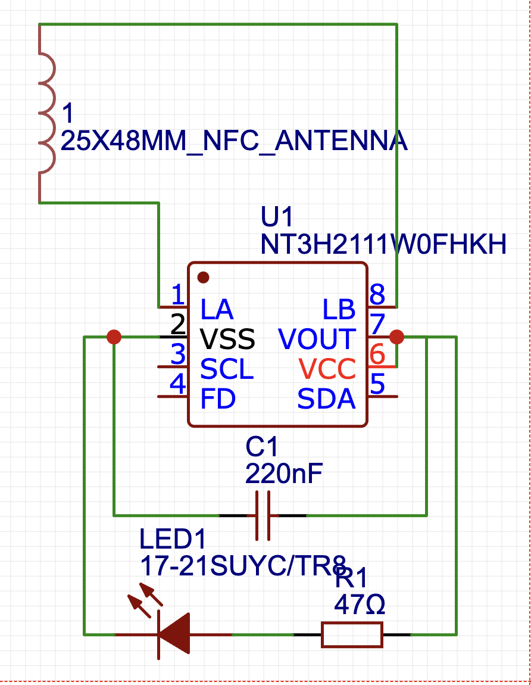
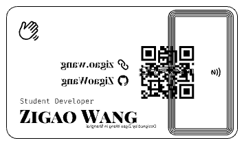
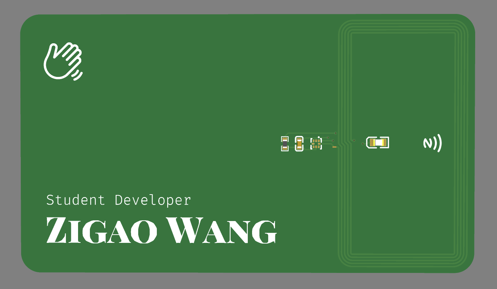
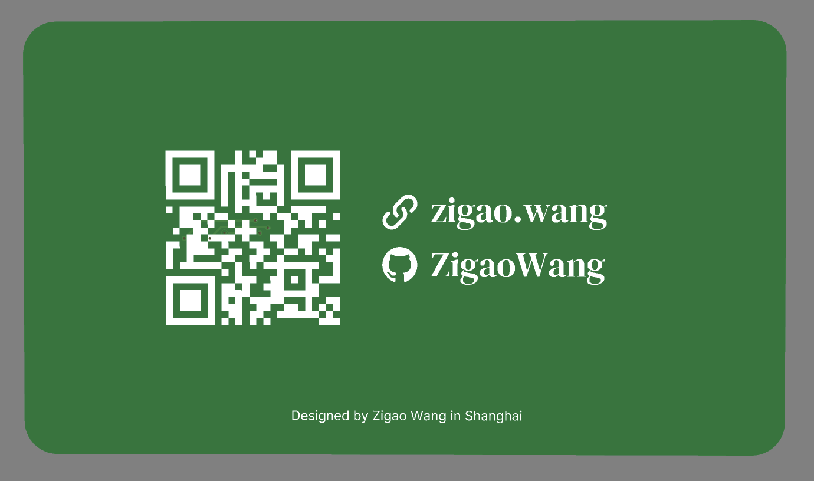
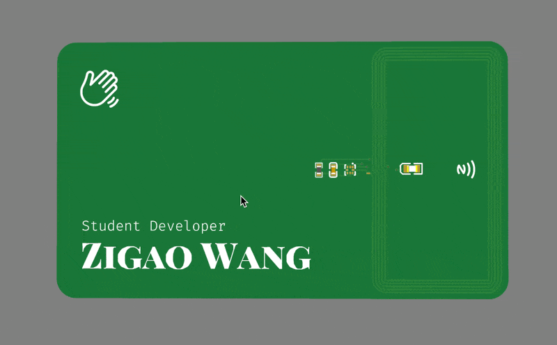

# PCB NFC Business Card

A sleek and interactive business card designed as a PCB, featuring NFC functionality for sharing contact details or other information.

This project was inspired by and created following the tutorial at [Hacker Card Jam](https://jams.hackclub.com/jam/hacker-card). Huge thanks to the Hack Club community for their guidance and support!

## Draft Design  


## Schematic  


## Gerber Files  


## Previews  
### Front and Back Side-by-Side  
<div align="left">
  
  
</div>

## Animation  


---

## Instructions
1. **Download**: Clone or download this repository.
2. **Customize**: Open the design files in your PCB software.
3. **Manufacture**: Send the Gerber files to a PCB manufacturer.
4. **Assemble**: Populate the board based on the schematic.
5. **Program NFC**: Write data to the NFC chip with a smartphone or writer.

---

## Flashing Data to NFC
Some NFC RFID readers, such as the ones on iPhones, may have trouble reading or writing the card - this is because the card hasn't been initialized from the factory yet. To initialize the chip, start off by installing an app with the capability to use custom NFC commands, such as **NFC Tools** (available for iOS and Android). 

Then, flash the NFC card with this advanced NFC command:

```
A2:03:E1:10:6D:00,A2:04:03:04:D8:00,A2:05:00:00:FE:00
```

This will format the chip and allow it to be written to. You can find more information about the flashing process [here on GitHub](https://github.com/Hugoyhu/NTAG-I2C-Eval-Board).

---

## Acknowledgments  
Thanks again to the [Hack Club](https://hackclub.com) for their amazing resources and support!
